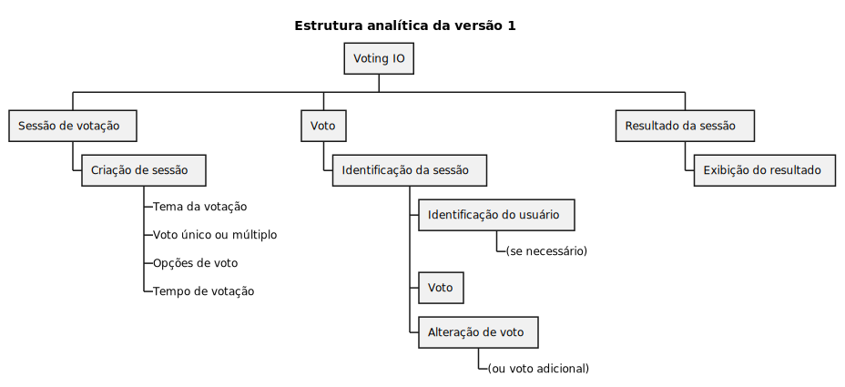
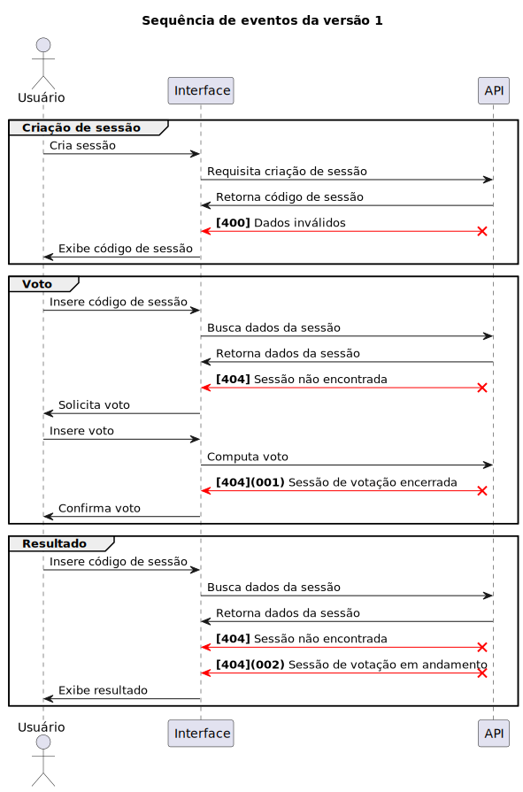

---
---

# Versão 1

Especificação para construção da API versão 1

## Sessão

O usuário ao entrar no sistema, poderá criar uma sessão utilizando as seguintes opções:

- Tema da votação
- Votos únicos ou múltiplos
- Opções de voto
- Tempo de votação

### Tema da votação

O usuário deverá escolher um tema para a votação, que será exibido no topo da página, juntamente com uma descrição que será exibida abaixo do tema.

- O tema da votação é obrigatório.
- O tema da votação deverá ser uma string de no máximo 50 caracteres.
- A descrição da votação deverá ser uma string de no máximo 150 caracteres.

### Votos únicos ou múltiplos

O usuário deverá escolher se a votação será feita por votos únicos ou múltiplos. Ao escolher votos únicos, toda vez que o usuário votar em uma opção, o voto anterior será sobrescrito. Ao escolher votos múltiplos, os votos anteriores serão somados.

- Ao escolher votos únicos, o usuário deverá se identificar por um email.
- Ao escolher votos múltiplos, o usuário não deverá se identificar.

### Opções de voto

O usuário deverá escolher as opções de voto, que serão exibidas como botões na página. O usuário poderá adicionar quantas opções de voto quiser, porém deverá haver no mínimo 2 opções de voto.

- As opções de voto deverão ser únicas.
- As opções de voto deverão ser strings de no mínimo 1 caracter e máximo 50 caracteres.

### Tempo de votação

O usuário deverá escolher o tempo de duração da votação, que será exibido como um contador regressivo na página. Ao final do tempo, a votação será encerrada e o resultado será exibido e nenhum voto adicional será aceito.

- O tempo de votação deverá ser um valor positivo.
- O tempo mínimo de votação é de 1 minuto.
- O tempo máximo de votação é de 1 semana.

### Identificação da sessão

Ao criar uma sessão, o usuário receberá um identificador único, que será utilizado para acessar a sessão pelos votantes.

## Voto

Ao entrar no sistema como votante, para efetuar seu(s) voto(s).

### Identificação da sessão

Através do idenficador único, o votante poderá acessar a sessão.

### Identificação do usuário

Caso a sessão tenha sido criada com votos únicos, o votante deverá se identificar com um email. Caso a sessão tenha sido criada com votos múltiplos, o votante não deverá se identificar.

### Escolha da opção de voto

O votante deverá escolher uma opção de voto, que será exibida como botões na página. O votante poderá selecionar somente uma opção de voto.

### Alteração da opção de voto

Caso a sessão tenha sido criada com votos únicos, ao votar em uma opção, o voto anterior será sobrescrito. Caso a sessão tenha sido criada com votos múltiplos, ao votar em uma opção, o voto anterior será somado.

## Resultado da sessão

Ao final do tempo de votação, a sessão será encerrada e o resultado será exibido.

- O resultado deverá ser exibido em ordem decrescente de votos.
- O resultado deverá ser exibido em porcentagem e em total de votos.

# Sequência de eventos

